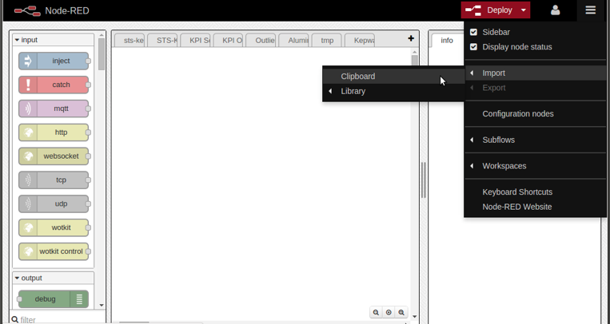
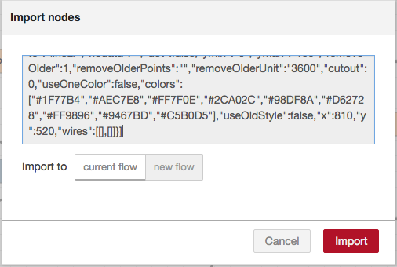
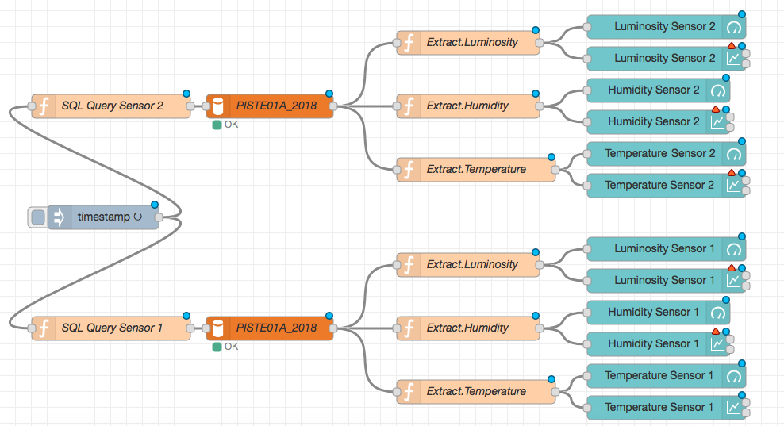

# User Interface : Node-RED

## File

* Node-Red-Flow-SolutionB.txt

## Deployment

 *  Type the following address in the browser :

 ` EC2_instance_ip : 1880`

 * Access the import from clipboard function under :

 ` Menu > Import > Clipboard `

 

 *  Copy the content of Node-Red-Flow-SolutionB.txt file and paste it into the modal window and click “import”

 
 
 * Imported flow !

 
